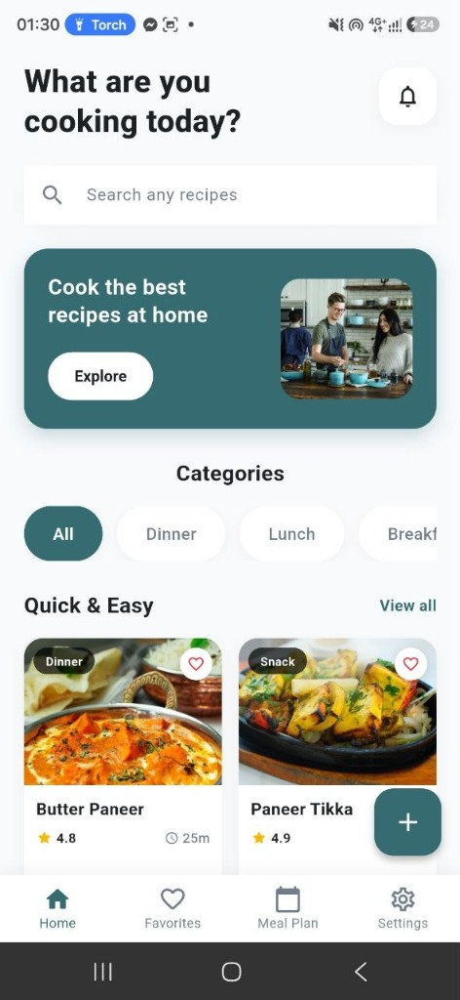
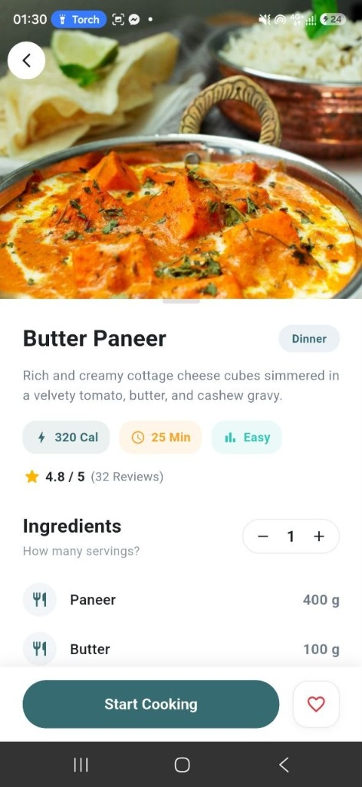
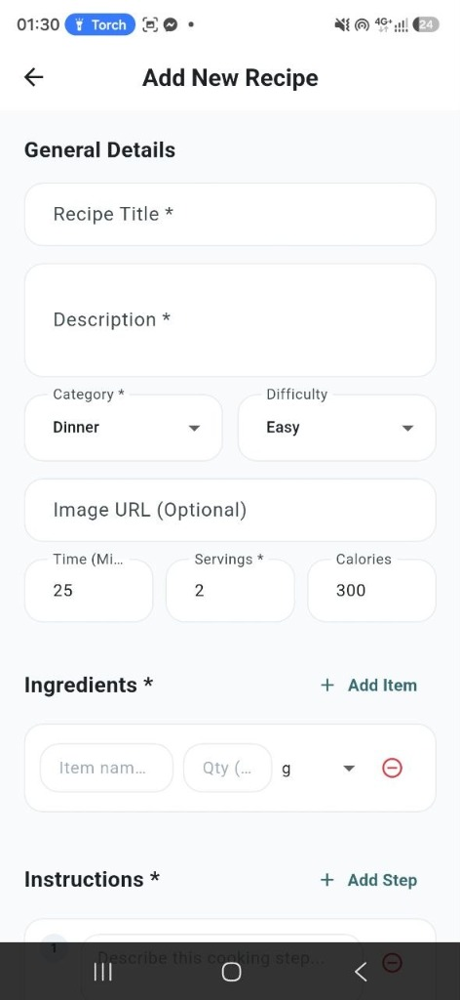
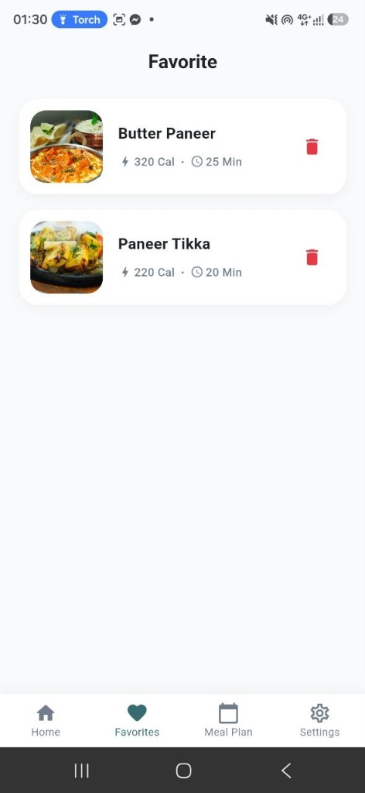
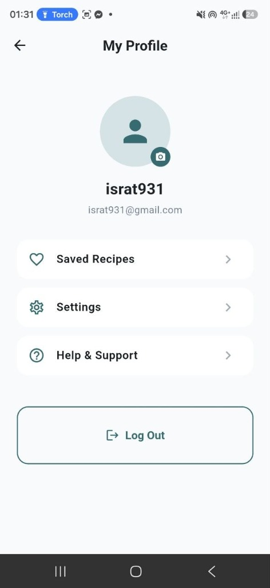

# 🍳 Recipe Hub — Modern Flutter & Firebase Cooking Companion

A beautifully crafted, modern **Flutter Recipe Application** built with **Firebase Authentication**, **Cloud Firestore**, and **Provider State Management**. The app provides culinary enthusiasts with an intuitive experience to discover, search, filter, scale ingredients, leave real-time reviews, save persistent favorites, and create custom recipes.

---

## 📸 Screenshots Showcase

<p align="center">
  
  
  
  
  
</p>

---

## ✨ Key Features

### 🔐 1. Firebase Authentication & User Profile
- **Secure Authentication**: Email & Password registration and login via Firebase Auth with validation and user-friendly error handling.
- **User Profiles**: Live Firestore user profile creation and management (`users/{uid}`).
- **Persistent Session State**: Maintains user authentication status seamlessly across application restarts.

### 🏠 2. Dynamic Home & Discovery Dashboard
- **Promotional Hero Banner**: Highlights featured cooking recipes with an interactive "Explore" call-to-action button.
- **Category Chips**: Quick category navigation (`All`, `Dinner`, `Lunch`, `Breakfast`, `Dessert`, `Snack`, `Vegetarian`).
- **Interactive Recipe Grid**: Displays recipes dynamically with real-time state updates.
- **Notifications Dialog**: Built-in modal dialog for recent recipe updates and notifications.

### 🔍 3. Real-Time Search & Multi-Level Filtering
- **Dynamic Live Search**: Instant case-insensitive filtering by recipe title or description text.
- **Category & Attribute Filter**: Dynamically filter recipes by meal category, cook time limits, and difficulty levels.
- **Empty State Handler**: Clean visual feedback with a "Clear Filters" action when no recipes match search criteria.

### 📖 4. Interactive Recipe Details & Ingredient Scaler
- **Collapsible Hero Banner**: Responsive collapsible image app bar (`SliverAppBar`).
- **Serving Quantity Adjuster**: Interactive `- 1 +` buttons that dynamically calculate scaled ingredient quantities in real time.
- **Interactive Cooking Walkthrough**: Step-by-step modal guide (`Start Cooking`) for hassle-free cooking.
- **Review & Rating System**: Real-time review submission form with star rating selector and average rating calculation.

### 💖 5. Persistent Favorites Management
- **Firestore Persistence**: User favorites synced live to Cloud Firestore (`users/{uid}` -> `favorites`), ensuring saved recipes persist across devices and logins.
- **Single-Column Clean List**: Clean horizontal cards with calorie/time metadata and instant one-tap removal.

### ➕ 6. Custom Recipe Management (CRUD)
- **Create Custom Recipe**: Add new recipes complete with category, prep time, calories, ingredients, and step-by-step instructions.
- **Edit & Delete**: Full control for recipe creators to edit or delete their published recipes.

---

## 🛠️ Tech Stack & Dependencies

| Layer | Technology |
|---|---|
| **Framework** | [Flutter](https://flutter.dev/) (Dart 3.x) |
| **State Management** | [Provider](https://pub.dev/packages/provider) (`MultiProvider`, `ChangeNotifier`) |
| **Authentication** | [Firebase Auth](https://firebase.google.com/docs/auth) |
| **Database** | [Cloud Firestore](https://firebase.google.com/docs/firestore) |
| **UI Components** | Material 3, Custom Glassmorphic & Rounded Cards, Custom Collapsible Slivers |

---

## 📂 Project Architecture & Directory Layout

```text
flutter_recipe/
├── screenshots/               # Actual application screenshots
│   ├── home_screen.jpg
│   ├── recipe_detail.jpg
│   ├── add_recipe.jpg
│   ├── favorites_screen.jpg
│   └── profile_screen.jpg
├── lib/
│   ├── app/
│   │   ├── app.dart           # MultiProvider setup & MaterialApp configuration
│   │   ├── routes.dart        # Named route management
│   │   └── theme.dart         # Global app theme palette
│   ├── models/
│   │   ├── recipe_model.dart  # Recipe data model & ingredient scaling engine
│   │   └── user_model.dart    # User profile model
│   ├── providers/
│   │   ├── auth_provider.dart     # Authentication state provider
│   │   ├── favorite_provider.dart # Favorites persistence provider
│   │   └── recipe_provider.dart   # Recipe CRUD & filtering provider
│   ├── repositories/
│   │   ├── auth_repository.dart   # Firebase Auth service layer
│   │   └── recipe_repository.dart # Firestore & sample dataset repository
│   ├── screens/
│   │   ├── auth/              # LoginScreen & RegisterScreen
│   │   ├── favorites/         # FavoritesScreen
│   │   ├── home/              # HomeScreen
│   │   ├── profile/           # ProfileScreen
│   │   ├── recipe/            # RecipeDetailScreen & AddEditRecipeScreen
│   │   ├── search/            # SearchScreen
│   │   └── splash/            # SplashScreen
│   ├── utils/
│   │   └── constants.dart     # AppColors, AppSpacing, & category definitions
│   ├── widgets/
│   │   ├── category_card.dart # Category filter chip widget
│   │   ├── custom_button.dart # Custom styled button
│   │   ├── empty_state.dart   # Empty & error state view widget
│   │   ├── loading_widget.dart# Standard loading indicator widget
│   │   └── recipe_card.dart   # Grid & list recipe card widget
│   └── main.dart              # Application entry point
└── test/
    └── widget_test.dart       # Unit & Widget test suite
```

---

## 🚀 Getting Started

### 1. Prerequisites
- **Flutter SDK**: `>=3.0.0`
- **Dart SDK**: `>=3.0.0`
- **Git**

### 2. Installation
```bash
# Clone the repository
git clone https://github.com/israt610/Flutter_Recipe_App.git

# Navigate to the project directory
cd Flutter_Recipe_App

# Install dependencies
flutter pub get
```

### 3. Firebase Configuration
Ensure your `firebase_options.dart` file is properly configured with your Firebase credentials or run:
```bash
flutterfire configure
```

### 4. Running the Application
- **Run on Web**:
  ```bash
  flutter run -d chrome
  ```
- **Run on Android / iOS**:
  ```bash
  flutter run
  ```

---

## 🧪 Testing & Code Quality

Run static code analysis:
```bash
flutter analyze
```

Run test suite:
```bash
flutter test
```

---

## 📜 License

This project is licensed under the MIT License - see the [LICENSE](LICENSE) file for details.
